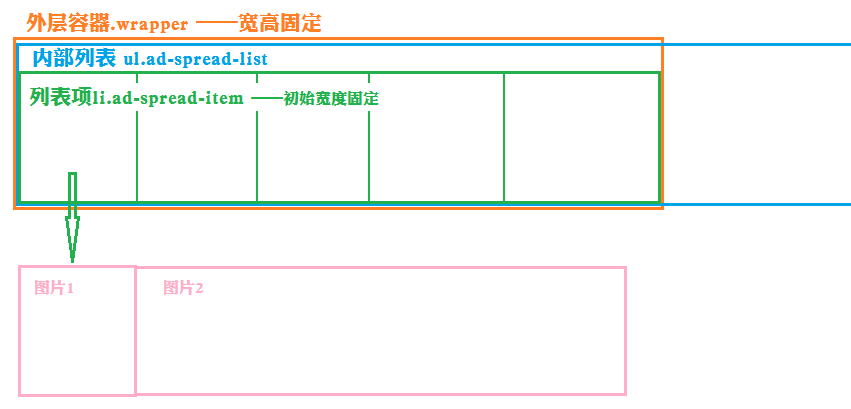

#### 腾讯视频广告条展开收缩效果


###### 思路分析
布局如下图所示：  


- 外层容器.wrapper为可视部分，宽度固定，overflow:hidden;。
- 内部列表ul为滚动部分，其宽度尽量设置大一些，否则内容会被挤到第二行，对动效有影响；
- 内部列表ul设置其position:relative; 根据鼠标下图片的index来判断其left值，目的在于使目标元素总在可视区域；
- 内部列表项li，初始宽度设置为第一幅小图的宽度，且overflow:hidden; 当mouseenter时，使其宽度变为两幅图片宽度之和。

布局代码如下：  

```
    <div class="wrapper">
        <ul class="ad-spread-list">
            <li class="ad-spread-item">
                <div class="ad-spread-pic">
                    <a href="#"></a>
                    <a href="#"></a>
                </div>
            </li>
            ...
        </ul>
    </div>
```
关键样式如下：  

```
<style>
    .wrapper{
        width:1250px; /*5副小图宽度之和*/
        height:105px;
        font-size:0;    /*解决inline-block带来的空格问题*/
        overflow:hidden;
    }
    .ad-spread-list{
        position:relative;
        left:0;
        width:9999px;
        height:105px;
    }
    .ad-spread-item,
    .ad-spread-pic > a{
        display:inline-block;
    }
    .ad-spread-item{
        width:250px;
        height:105px;
        overflow:hidden;
    }
</style>

```

###### jQuery实现主要动效代码
1. 使用事件委派函数，将事件绑定在父元素上，设置触发函数为子元素li
2. 使用index()函数获取当前目标对象在父元素中下标
3. 使用animate()函数生成动态效果

**关键代码分析：**  
```
if($(this).is($(':last-child'))){
    $(this).parents("ul").animate({
        left:-250 * (i-1) + "px"
    },'fast');
}else{
    $(this).parents("ul").animate({
        left:-250 * i + "px"
    },'fast');
}
```
> 根据当前元素的下标，来设置父元素ul的left值：  
> 通过观察可发现，ul向左移动的距离为当前元素对象之前的所有图片宽度之和。   
> 但是目标对象为最后一幅图时需注意，ul的left值为 图片宽度 * (i-1)

**源码如下：**

```
$(function(){
    $(".ad-spread-list ").on('mouseenter',"li",function(event){
        var i = $(this).index(); //获取当前目标元素的下标
        $(this).animate({
            width:994,
        },'fast');
        if($(this).is($(':last-child'))){
            $(this).parents("ul").animate({
                left:-250 * (i-1) + "px"
            },'fast');
        }else{
            $(this).parents("ul").animate({
                left:-250 * i + "px"
            },'fast');
        }
    });
    $(".ad-spread-list ").on('mouseleave',"li",function(event){
        $(this).animate({
            width:250,
        },'fast');
        $(this).parents("ul").animate({
            left:0
        },'fast');
});
```
**注意事项：**  
1. 事件应为 mouseenter 和 mouseleave，而不是mouseover 和 mouseout。这是因为一副图片展开只需触发一次，mouseover事件当鼠标在图片上移动时会一直重复动画。    
2. 为保证良好的动画效果，ul和li的动画速度需一致。


demo地址： https://github.com/MoMosMemory/achieve-the-dynamic-effect-of-adsBar
